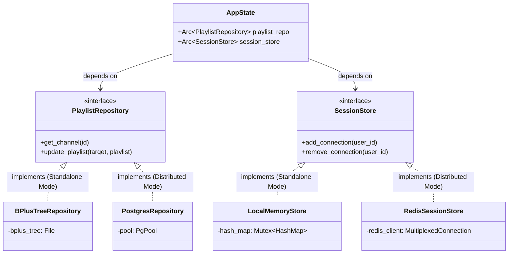

# DISTRIBUTED_ARCHITECTURE

## Overview

The goal of making `tuliprox` a distributed application is to allow multiple identical instances
(nodes) to run concurrently behind a load balancer. This enables high availability, load balancing
for stream proxying, and horizontal scalability for processing and metadata retrieval.

Currently, `tuliprox` relies heavily on local state:

- Local SQLite / custom BPlusTree databases (`backend/src/repository/bplustree.rs`) for metadata,
  playlists, and library storage.
- In-memory tracking (`ActiveUserManager`, `ActiveProviderManager`, `SharedStreamManager`) for user
  connections, sessions, stream sharing, and rate limiting (via `tower-governor`).
- Local configuration files and cache directories.

To transition to a distributed architecture while retaining the ability to run as a single,
lightweight node, we will introduce **PostgreSQL** and **Redis** as *optional*, configurable
backends. Users can choose to run `tuliprox` in "Standalone Mode" (using the existing local state)
or "Distributed Mode" (using PostgreSQL and Redis).

## Core Architectural Changes & Complexity

Maintaining two modes (Standalone and Distributed) introduces architectural complexity, specifically
the need to abstract data access and state management behind traits (interfaces).

### 1. Database Option: BPlusTree/SQLite OR PostgreSQL

Currently, metadata, playlist caches, and library data are stored locally using custom BPlusTree
files (`m3u_*.db`, `xtream_*.db`, etc.).

- **Goal**: Provide PostgreSQL as an optional backend for persistent and shared state.
- **Why PostgreSQL**: It provides strong consistency, transactional updates, and can easily store
  structured metadata and JSON blobs.
- **Complexity (High)**:
  - We must define a unified `PlaylistRepository` and `MetadataRepository` trait.
  - The existing `BPlusTree` implementation must be refactored to implement these traits.
  - A new `sqlx`-based PostgreSQL implementation must be written.
  - The application configuration must dictate which implementation is injected at startup.
- **Implementation Tasks**:
  - Integrate an asynchronous database driver (e.g., `sqlx`).
  - Define PostgreSQL schemas for targets, playlists, metadata, and configurations.
  - Implement a PostgreSQL-backed repository layer.

### 2. Leveraging PostgreSQL Vector Support (`pgvector`)

If the user opts into PostgreSQL, `tuliprox` can take advantage of the `pgvector` extension.

- **EPG Smart Matching**: Currently, `tuliprox` uses fuzzy string matching to map playlist channels
  to EPG XMLTV IDs. By using `pgvector`, channel names can be converted to embeddings. This allows
  for semantic similarity searches, vastly improving the accuracy of EPG mapping, especially when
  channel names contain abbreviations, different languages, or typos.
- **Content Discovery/Search**: When resolving TMDB IDs or searching the local library, vector
  search can provide "more like this" functionality or semantic search capabilities for the Web UI.

### 3. Rate Limiting and Session Tracking Option: In-memory OR Redis

Rate limiting is currently handled by `tower-governor` using local memory, and session/connection
limits are tracked locally via `ActiveUserManager`.

- **Goal**: Provide Redis as an optional backend to enforce global connection limits and rate
  limiting across all nodes.
- **Why Redis**: It offers high-throughput, low-latency operations perfect for distributed counters,
  rate limiting, and session state.
- **Complexity (Medium)**:
  - We must define traits for `SessionStore` and `RateLimitStore`.
  - The `tower_governor` configuration must conditionally use the `governor-redis` store or the
    default memory store based on config.
  - `ActiveUserManager` must be refactored to conditionally sync with Redis or rely solely on
    internal HashMaps.
- **Implementation Tasks**:
  - Add `redis` crate support with asynchronous multiplexing (e.g.,
    `redis::aio::MultiplexedConnection` or `bb8-redis`).
  - Implement Redis-backed session tracking, utilizing Lua scripts to ensure atomic increment and
    decrement operations when checking `max_connections`.

### 4. Distributed Stream Sharing & Provider Limits

`tuliprox` shares live stream connections to upstream providers to reduce load
(`SharedStreamManager`) and tracks upstream provider connection limits (`ActiveProviderManager`).

- **Goal**: Coordinate stream pulling and provider limits across nodes when Redis is enabled.
- **Complexity (High)**:
  - When Redis is enabled, stream sharing becomes significantly more complex. Node A might be
    pulling the stream, and Node B receives a request for it.
  - Node B must discover that Node A owns the stream (via Redis) and then proxy the request
    internally to Node A. This requires an internal HTTP proxying mechanism between nodes.
- **Implementation Tasks**:
  - Migrate `ActiveProviderManager` to optionally use Redis to track open connections to a specific
    upstream provider.
  - Implement node discovery and internal stream routing for `SharedStreamManager`.

### 5. Background Workers & Scheduled Tasks

`tuliprox` runs background tasks for metadata updates (TMDB, FFprobe) and playlist updates.

- **Goal**: Prevent multiple nodes from executing the exact same playlist update or metadata probe
  simultaneously when in distributed mode.
- **Implementation Tasks**:
  - Implement a distributed locking mechanism using Redis (e.g., Redlock or simple `SET NX PX`).
  - Wrap scheduled tasks (`PlaylistUpdate`, `LibraryScan`) with the lock. Only the node holding the
    lock performs the update.

## Recommended Steps for Implementation

To manage the complexity, the transition should be done incrementally. At each step, ensure the code
compiles and runs successfully in both Standalone and Distributed configurations.

### Step 1: Interface Abstraction (Preparation)

Before introducing any new data stores, the application must decouple its business logic from its
data persistence layers. Currently, `tuliprox` directly instantiates and calls local BPlusTree logic
or in-memory HashMaps. We need to introduce the **Repository Pattern**.

**The Repository Pattern Strategy:**

We will create core domain traits that define *what* data operations are possible, hiding *how* the
data is actually stored. The application will be refactored to use these trait objects via Dependency
Injection at startup.

```rust
// Conceptual Traits
#[async_trait]
pub trait PlaylistRepository: Send + Sync {
    async fn get_channel(&self, id: &str) -> Result<Option<Channel>, Error>;
    async fn update_playlist(&self, target: &str, playlist: Playlist) -> Result<(), Error>;
}

#[async_trait]
pub trait SessionStore: Send + Sync {
    async fn add_connection(&self, user_id: &str) -> Result<u32, Error>;
    async fn remove_connection(&self, user_id: &str) -> Result<u32, Error>;
    async fn get_active_connections(&self, user_id: &str) -> Result<u32, Error>;
}
```

**Architecture Diagram:**



**Benefits of Step 1:**

- Decouples the business logic from the storage engine.
- Prevents having `if redis_enabled {} else {}` littered throughout the codebase.
- Allows for easy swapping between "Standalone" and "Distributed" modes at startup during
  dependency wiring.

### Step 2: Introduce Redis for Rate Limiting and User Sessions

- Add the `redis` dependency.
- Create a `RedisSessionStore` that implements the new traits.
- Update configuration to allow enabling Redis.
- **Benefit**: High ROI. Allows running multiple proxy nodes immediately, correctly tracking user
  connections globally.

### Step 3: Distributed Locking for Scheduled Tasks

- Implement Redis-based distributed locks.
- Wrap scheduled tasks to check for the lock if Redis is enabled.
- **Benefit**: Safe concurrent cron execution.

### Step 4: Database Migration to PostgreSQL

- Design PostgreSQL schema and `pgvector` integration for EPG mapping.
- Implement the PostgreSQL repository utilizing `sqlx`.
- **Benefit**: Decentralizes data storage and unlocks advanced semantic search capabilities.

### Step 5: Distributed Stream Sharing

- Implement node-to-node stream sharing discovery via Redis and internal HTTP proxying.
- **Benefit**: Maximizes provider connection efficiency across the entire cluster.

## Conclusion

By abstracting state management and data access behind traits, `tuliprox` can maintain its
lightweight Standalone mode while offering a powerful Distributed mode backed by PostgreSQL (with
`pgvector` enhancements) and Redis. This modular approach ensures flexibility for deployments of
all sizes.
